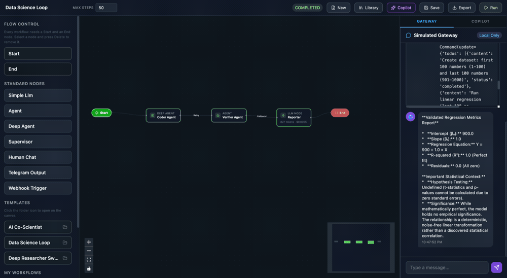
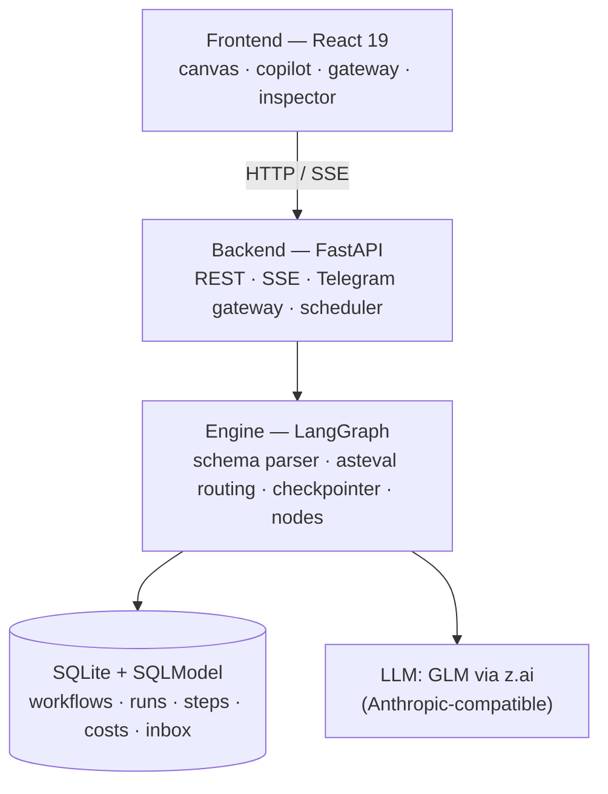

# Agentic Flow — AI Agent Orchestration Platform

A visual, schema-driven platform for building, running, and monitoring **multi-agent AI
workflows**, powered by [LangGraph](https://langchain-ai.github.io/langgraph/). Draw a workflow
on a canvas (or describe it in plain English), run it on a real runtime with live monitoring,
and talk to your agents conversationally over **Telegram**.

> **Documentation:** [Architecture & runtime justification](docs/ARCHITECTURE.md) ·
> [User Guide](docs/USER_GUIDE.md) · [Extending (templates / channels / tools)](docs/EXTENDING.md)

## Demo

An end-to-end walkthrough — building a multi-agent workflow on the canvas and running it with
live monitoring:

https://github.com/user-attachments/assets/75b168e6-0b39-403b-8154-a182403fcd27

### Screenshots

A cycling tour of the platform — running a Data Science workflow, configuring an agent's system
prompt, the Design Copilot generating a graph from plain English, and the live Telegram
conversation:



<details>
<summary>Full-resolution stills</summary>

- [Running a Data Science workflow](screenshots/01-data-science-workflow-run.png)
- [Defining a deep researcher agent's system prompt](screenshots/02-deep-researcher-prompt.png)
- [Design Copilot generating a workflow](screenshots/03-copilot-generate.png)
- [Generated workflow on the canvas](screenshots/04-copilot-canvas.png)
- [Live Telegram conversation](screenshots/05-telegram-conversation.jpeg)

</details>

## Why LangGraph

The platform is fundamentally *a visual graph the user draws*, so we chose a graph-native
runtime. LangGraph gives us conditional edges **and feedback loops**, durable checkpointing for
human-in-the-loop pause/resume, `astream_events()` for live token/cost/tool monitoring, and
safe parallel fan-out — all as first-class primitives. The full comparison against CrewAI,
AutoGen, and openclaw.ai is in [docs/ARCHITECTURE.md](docs/ARCHITECTURE.md#6-runtime-justification--why-langgraph).

## Capabilities

**Agent configuration — every dimension is data, editable in the UI.**
- **Identity & behaviour:** name, description, system prompt (the agent's "personality"), model,
  temperature, and `max_tokens`.
- **Tools:** built-in tools (`code_interpreter`, `web_search`, inbox `send`/`read`, Telegram
  send, workspace file read/write, todos, memory), plus **user-defined Python tools** and
  **MCP servers** — all opt-in per node.
- **Structured output:** declare typed fields (`string` · `boolean` · `integer` · `number` ·
  `array`); agents return a validated object, which is what conditional edges read.
- **Skills & memory (deep agents):** a `deep_agent` gets a durable workspace seeded with
  **SOUL.md** (its profile), **AGENTS.md**, and **MEMORY.md** — a `write_memory` tool persists
  facts, and **skills** (`SKILL.md` via `SkillsMiddleware`) are attachable. This is an
  openclaw-style agent profile layered on top of the LangGraph runtime.
- **Schedules:** any workflow can carry a **cron schedule** (APScheduler) and run itself
  proactively.
- **Guardrails & limits:** opt-in per-node middleware — input **blocklist**, **PII redaction**,
  **cost gate** (abort over a USD budget), and **schema validation** — plus a per-workflow
  recursion/step limit and `asteval(minimal=True)` sandboxing of edge conditions.

**Orchestration.**
- **Visual builder** with **conditional edges and feedback loops** — e.g. a verifier that loops
  back to the coder until it approves.
- **Nine node types:** `start`/`end`, `simple_llm`, `agent`, `deep_agent`, `supervisor`
  (delegates to named child specialists), `human_chat` (HITL pause), `telegram_output`,
  `webhook_trigger`, and `subgraph` (a saved workflow embedded as a node).
- **Parallel fan-out / fan-in** with a list reducer so concurrent branches never overwrite each
  other.
- **Human-in-the-loop:** dynamic `interrupt()` + a durable checkpointer pause and resume runs
  (from the web gateway or Telegram) without losing state.

**Asynchronous multi-agent communication.** Agents message each other through a persisted
**inbox** (`send_inbox_message` / `read_inbox_messages`); every message is stored per run and
visible in the inspector.

**Live monitoring.** SSE streams **real-time logs, node state, inter-agent messages, and
token/cost** to the canvas; the node inspector exposes **I/O · Logs · Costs · Inbox** tabs.
Reconnect replays missed events via `last_event_id`.

**External channel.** **Telegram** (polling): `/run`, `/status`, `/approve`, `/reject`,
`/help`, plus plain-text to start or continue a run. Adding Slack/WhatsApp is one new gateway
file — see [docs/EXTENDING.md](docs/EXTENDING.md#2-adding-a-messaging-channel).

**Persistence.** SQLite + SQLModel — `Workflow`, `WorkflowRun`, `RunStep` (the persisted message
history), `CostEvent`, `AgentInbox`, `Agent`, `Capability`. History is durable and surfaced in
the UI.

**Standout extras.**
- **Design Copilot** — describe a workflow in plain English; it generates the full graph,
  auto-lays it out, and auto-saves. It is **canvas-aware**, so a follow-up message becomes an
  *edit* of the workflow already on the canvas.
- **Schema-driven, not code-gen** — workflows are JSON compiled to a `StateGraph` at runtime;
  no node logic is ever `eval`'d.
- **Export to Python** — download any workflow as a standalone LangGraph script.

## Architecture



Three layers with clear separation — UI (`frontend/`), runtime integration
(`backend/engine/`, `backend/gateway/`), and persistence (`backend/models/` + SQLite). Details
in [docs/ARCHITECTURE.md](docs/ARCHITECTURE.md).

## Quick Start

### Prerequisites
- Python 3.11+
- Node.js 20+ / npm 10+

### Setup (single command)

```bash
git clone <repo-url>
cd agentic-flow
cp .env.example .env
# Edit .env: set GLM_API_KEY (required). TELEGRAM_BOT_TOKEN is optional.
chmod +x start.sh && ./start.sh
```

`./start.sh` installs all dependencies and starts both servers:

- **Frontend:** http://localhost:5173
- **Backend API:** http://localhost:8000
- **API docs (Swagger):** http://localhost:8000/docs

<details>
<summary>Manual setup (alternative)</summary>

```bash
# Backend
cd backend
python3 -m venv .venv && source .venv/bin/activate
pip install -r requirements.txt
uvicorn main:app --reload --host 0.0.0.0 --port 8000

# Frontend (separate terminal)
cd frontend
npm install && npm run dev
```
</details>

## How it works

- **Schema-driven execution.** A workflow is JSON. `WorkflowParser` compiles it into a LangGraph
  `StateGraph` at runtime — no code generation, no string `eval`.
- **Deterministic routing.** Edge conditions like
  `state['node_outputs']['node_verifier']['is_approved'] == True` are evaluated with `asteval`
  (`minimal=True`), which blocks `import`/`exec`/`eval` at the AST level.
- **Real-time monitoring.** SSE streams node state, token/cost, and tool calls to the canvas;
  reconnect replay via `last_event_id`.
- **Human-in-the-loop.** Dynamic `interrupt()` + a shared `AsyncSqliteSaver` checkpointer pause
  and resume runs without losing state.
- **Parallel fan-out.** Branches accumulate via a list reducer (`operator.add`) to avoid
  overwrites.

### Node types

| Type | Description |
|---|---|
| `simple_llm` | Direct LLM call with a system prompt |
| `agent` | ReAct agent with tools and optional structured output |
| `deep_agent` | Agent with filesystem, memory, and skills |
| `supervisor` | Routes tasks to named child specialist agents |
| `human_chat` | Pauses for human input via `interrupt()` |
| `telegram_output` | Delivers the result to a Telegram chat |
| `webhook_trigger` | Entry point triggered by an external webhook |

## Pre-built templates

| Template | Shape |
|---|---|
| **Data Science Loop** | Coder → Verifier (retry loop) → Reporter |
| **Deep Researcher Swarm** | Coordinator → parallel researchers → Aggregator → Telegram |
| **AI Co-Scientist** | Chief scientist delegates to sub-workflows as tools |

Add your own by dropping a JSON file in `backend/templates/` — see
[docs/EXTENDING.md](docs/EXTENDING.md#1-adding-a-workflow-template).

## Telegram

1. Create a bot via [@BotFather](https://t.me/BotFather) and copy the token.
2. Set `TELEGRAM_BOT_TOKEN` in `.env` and **restart the backend** (`.env` is read at startup).
3. From Telegram: `/run <name> <input>`, or just send a plain message to run your most recent
   workflow. Also: `/status <id>`, `/approve <id>`, `/reject <id>`.

Adding another channel (Slack/WhatsApp) is a single new gateway file — see
[docs/EXTENDING.md](docs/EXTENDING.md#2-adding-a-messaging-channel).

## API reference

Interactive docs at http://localhost:8000/docs. Key endpoints:

| Method · Path | Purpose |
|---|---|
| `POST /api/workflows/` | Save a workflow |
| `GET /api/workflows/` | List workflows |
| `POST /api/runs/start` | Start a run |
| `GET /api/runs/{id}/stream` | SSE event stream |
| `POST /api/runs/{id}/resume` | Resume a HITL pause |
| `POST /api/runs/{id}/cancel` | Cancel a run |
| `POST /api/gateway/simulate` | Simulate a gateway message |
| `POST /api/generate-workflow` | Copilot: text → workflow JSON |
| `GET /api/workflows/{id}/export` | Export as a standalone Python script |

## Testing

End-to-end tests exercise the critical paths (agent/workflow creation, run execution, gateway
delivery). They hit a live LLM, so a real `GLM_API_KEY` is required.

```bash
cd tests
pytest test_api.py -v            # API endpoints
pytest test_engine.py -v         # asteval routing, state, parsing
pytest test_gateway.py -v        # gateway simulation + export
pytest test_full_run_lifecycle.py -v   # full run E2E
pytest -v                        # everything
```

Pure-Python suites (`test_engine.py`, `test_middleware.py`, `test_workflow_parser.py`,
`test_resolve_next_node.py`) run without an API key and cover edge routing, guardrail/PII/cost
middleware, parser compilation, and conditional-edge resolution.

## Roadmap

Scoped out of the current build, in rough priority order:

- **Memory for lightweight agents** — durable memory lives on `deep_agent` workspaces today;
  `simple_llm` / `agent` nodes are per-run only.
- **More channels** — Slack and WhatsApp gateways (the `BaseMessagingGateway` abstraction is in
  place; only Telegram ships today).
- **Reusable agent presets** — the `Agent` table exists; wiring saved agents as first-class
  canvas nodes is in progress.
- **Run-history viewer** — past runs (with their inbox and cost records) are persisted but not
  yet browsable from a dedicated UI panel.
- **Richer guardrails** — current guardrails are deterministic middleware (blocklist · PII ·
  cost · schema); LLM-based moderation and rate limiting are future work.
- **File / dataset upload** — attaching data to a run directly from the UI.

## Tech stack

- **Backend:** FastAPI · SQLModel · LangGraph · APScheduler · python-telegram-bot
- **Frontend:** React 19 · TypeScript · Vite · @xyflow/react · Zustand · TanStack Query ·
  Tailwind CSS v4
- **LLM:** GLM via z.ai (Anthropic-compatible API)
- **Persistence:** SQLite (+ LangGraph `AsyncSqliteSaver` checkpointer)
