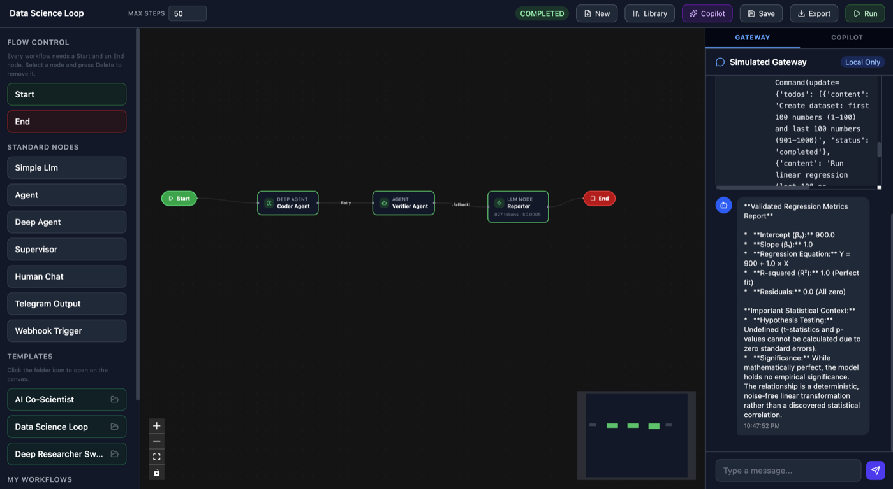
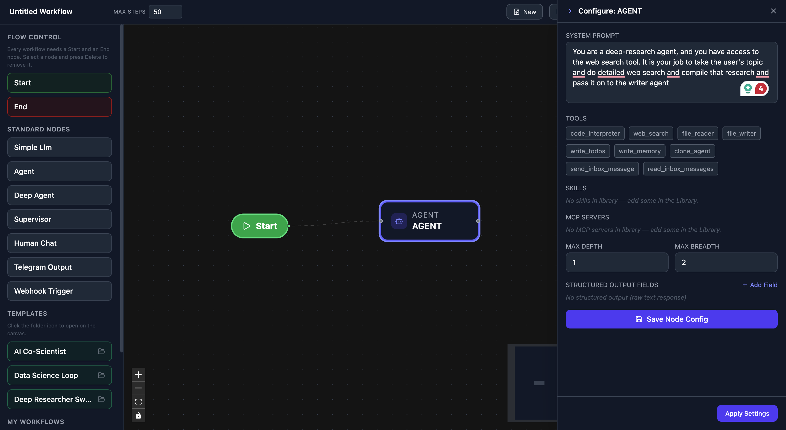
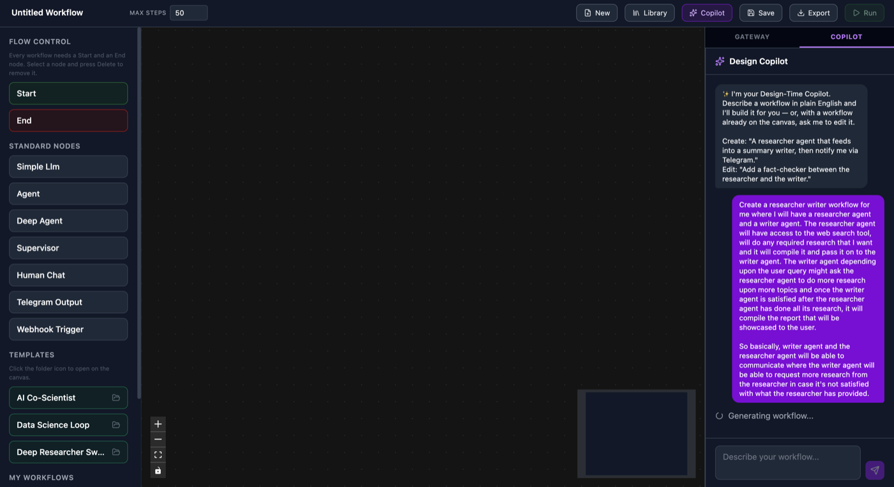
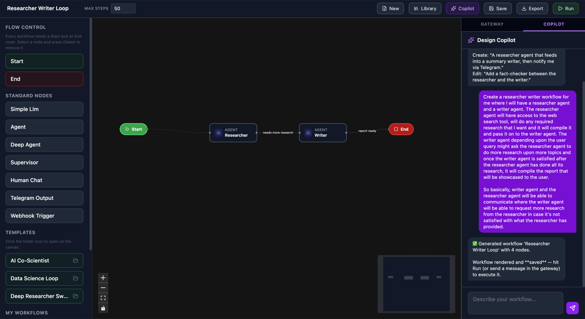
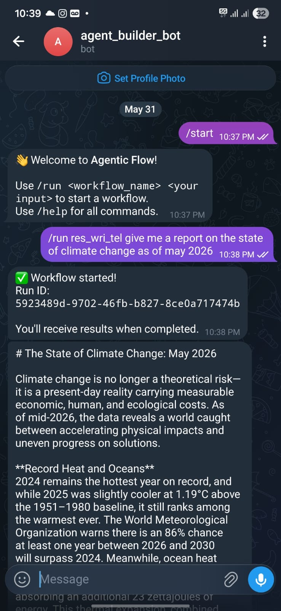
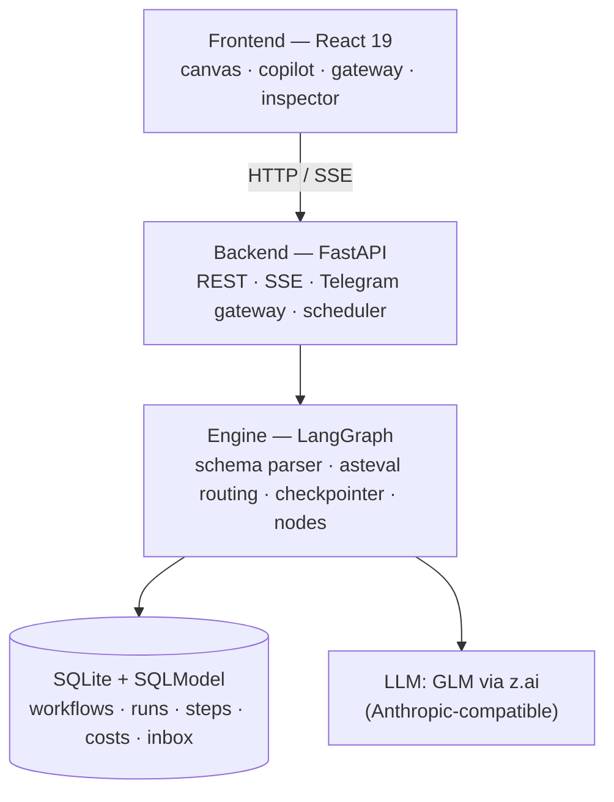

# Agentic Flow — AI Agent Orchestration Platform

A visual, schema-driven platform for building, running, and monitoring **multi-agent AI
workflows**, powered by [LangGraph](https://langchain-ai.github.io/langgraph/). Draw a workflow
on a canvas (or describe it in plain English), run it on a real runtime with live monitoring,
and talk to your agents conversationally over **Telegram**.

> **Documentation:** [Architecture & runtime justification](docs/ARCHITECTURE.md) ·
> [User Guide](docs/USER_GUIDE.md) · [Extending (templates / channels / tools)](docs/EXTENDING.md)

## Demo

An end-to-end walkthrough — building a multi-agent workflow on the canvas and running it with
live monitoring (the Telegram integration is shown in the screenshots below):

https://github.com/user-attachments/assets/75b168e6-0b39-403b-8154-a182403fcd27

### Screenshots

A walkthrough in five frames — **click any panel to expand it**, then collapse it and open the next.

<details open>
<summary><b>1 · Running a Data Science workflow</b> — ask a regression question, get a computed answer back</summary>



</details>

<details>
<summary><b>2 · Building a workflow</b> — defining the system prompt for a deep researcher agent</summary>



</details>

<details>
<summary><b>3 · Design Copilot</b> — describe a workflow in plain English, watch it generate a complete graph</summary>



</details>

<details>
<summary><b>4 · Copilot result</b> — the generated workflow, auto-laid-out on the canvas with conditional edges</summary>



</details>

<details>
<summary><b>5 · Telegram integration</b> — ask a workflow from Telegram, get the answer back on your phone</summary>



</details>

## Why LangGraph

The platform is fundamentally *a visual graph the user draws*, so we chose a graph-native
runtime. LangGraph gives us conditional edges **and feedback loops**, durable checkpointing for
human-in-the-loop pause/resume, `astream_events()` for live token/cost/tool monitoring, and
safe parallel fan-out — all as first-class primitives. The full comparison against CrewAI,
AutoGen, and openclaw.ai is in [docs/ARCHITECTURE.md](docs/ARCHITECTURE.md#6-runtime-justification--why-langgraph).

## Architecture



Three layers with clear separation — UI (`frontend/`), runtime integration
(`backend/engine/`, `backend/gateway/`), and persistence (`backend/models/` + SQLite). Details
in [docs/ARCHITECTURE.md](docs/ARCHITECTURE.md).

## Quick Start

### Prerequisites
- Python 3.11+
- Node.js 20+ / npm 10+

### Setup (single command)

```bash
git clone <repo-url>
cd agentic-flow
cp .env.example .env
# Edit .env: set GLM_API_KEY (required). TELEGRAM_BOT_TOKEN is optional.
chmod +x start.sh && ./start.sh
```

`./start.sh` installs all dependencies and starts both servers:

- **Frontend:** http://localhost:5173
- **Backend API:** http://localhost:8000
- **API docs (Swagger):** http://localhost:8000/docs

<details>
<summary>Manual setup (alternative)</summary>

```bash
# Backend
cd backend
python3 -m venv .venv && source .venv/bin/activate
pip install -r requirements.txt
uvicorn main:app --reload --host 0.0.0.0 --port 8000

# Frontend (separate terminal)
cd frontend
npm install && npm run dev
```
</details>

## How it works

- **Schema-driven execution.** A workflow is JSON. `WorkflowParser` compiles it into a LangGraph
  `StateGraph` at runtime — no code generation, no string `eval`.
- **Deterministic routing.** Edge conditions like
  `state['node_outputs']['node_verifier']['is_approved'] == True` are evaluated with `asteval`
  (`minimal=True`), which blocks `import`/`exec`/`eval` at the AST level.
- **Real-time monitoring.** SSE streams node state, token/cost, and tool calls to the canvas;
  reconnect replay via `last_event_id`.
- **Human-in-the-loop.** Dynamic `interrupt()` + a shared `AsyncSqliteSaver` checkpointer pause
  and resume runs without losing state.
- **Parallel fan-out.** Branches accumulate via a list reducer (`operator.add`) to avoid
  overwrites.

### Node types

| Type | Description |
|---|---|
| `simple_llm` | Direct LLM call with a system prompt |
| `agent` | ReAct agent with tools and optional structured output |
| `deep_agent` | Agent with filesystem, memory, and skills |
| `supervisor` | Routes tasks to named child specialist agents |
| `human_chat` | Pauses for human input via `interrupt()` |
| `telegram_output` | Delivers the result to a Telegram chat |
| `webhook_trigger` | Entry point triggered by an external webhook |

## Pre-built templates

| Template | Shape |
|---|---|
| **Data Science Loop** | Coder → Verifier (retry loop) → Reporter |
| **Deep Researcher Swarm** | Coordinator → parallel researchers → Aggregator → Telegram |
| **AI Co-Scientist** | Chief scientist delegates to sub-workflows as tools |

Add your own by dropping a JSON file in `backend/templates/` — see
[docs/EXTENDING.md](docs/EXTENDING.md#1-adding-a-workflow-template).

## Telegram

1. Create a bot via [@BotFather](https://t.me/BotFather) and copy the token.
2. Set `TELEGRAM_BOT_TOKEN` in `.env` and **restart the backend** (`.env` is read at startup).
3. From Telegram: `/run <name> <input>`, or just send a plain message to run your most recent
   workflow. Also: `/status <id>`, `/approve <id>`, `/reject <id>`.

Adding another channel (Slack/WhatsApp) is a single new gateway file — see
[docs/EXTENDING.md](docs/EXTENDING.md#2-adding-a-messaging-channel).

## API reference

Interactive docs at http://localhost:8000/docs. Key endpoints:

| Method · Path | Purpose |
|---|---|
| `POST /api/workflows/` | Save a workflow |
| `GET /api/workflows/` | List workflows |
| `POST /api/runs/start` | Start a run |
| `GET /api/runs/{id}/stream` | SSE event stream |
| `POST /api/runs/{id}/resume` | Resume a HITL pause |
| `POST /api/runs/{id}/cancel` | Cancel a run |
| `POST /api/gateway/simulate` | Simulate a gateway message |
| `POST /api/generate-workflow` | Copilot: text → workflow JSON |
| `GET /api/workflows/{id}/export` | Export as a standalone Python script |

## Testing

End-to-end tests exercise the critical paths (agent/workflow creation, run execution, gateway
delivery). They hit a live LLM, so a real `GLM_API_KEY` is required.

```bash
cd tests
pytest test_api.py -v            # API endpoints
pytest test_engine.py -v         # asteval routing, state, parsing
pytest test_gateway.py -v        # gateway simulation + export
pytest test_full_run_lifecycle.py -v   # full run E2E
pytest -v                        # everything
```

## Tech stack

- **Backend:** FastAPI · SQLModel · LangGraph · APScheduler · python-telegram-bot
- **Frontend:** React 19 · TypeScript · Vite · @xyflow/react · Zustand · TanStack Query ·
  Tailwind CSS v4
- **LLM:** GLM via z.ai (Anthropic-compatible API)
- **Persistence:** SQLite (+ LangGraph `AsyncSqliteSaver` checkpointer)
