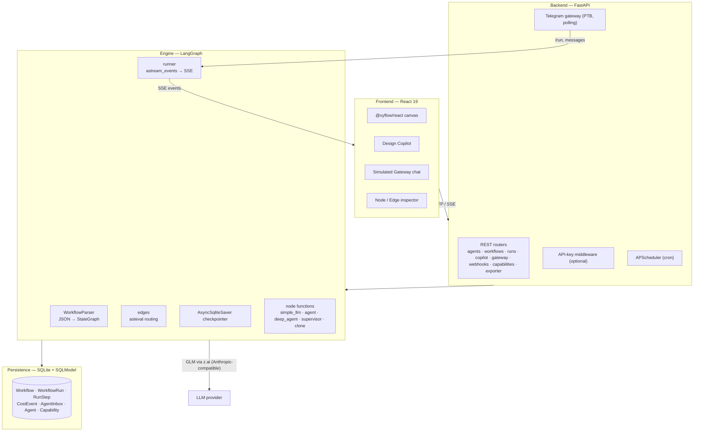
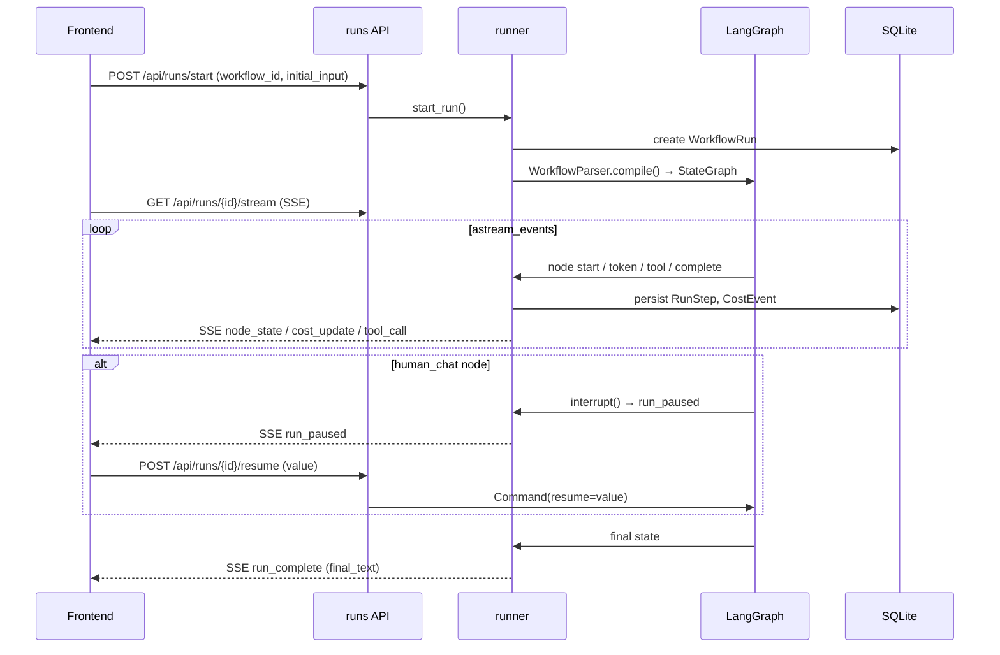

# Architecture

This document explains how Agentic Flow is built, the responsibilities of each layer, and
the reasoning behind the major technical decisions.

## 1. High-level overview

Agentic Flow is a **schema-driven multi-agent orchestration platform**. A workflow is a JSON
document describing nodes (agents) and edges (control flow). The backend compiles that JSON
into a live [LangGraph](https://langchain-ai.github.io/langgraph/) `StateGraph` and executes
it on a real runtime — there is no code generation and no string `eval` of node logic.

The three layers map cleanly onto the challenge's "UI layer / agent-runtime integration /
data-persistence layer" separation:

| Layer | Location | Responsibility |
|---|---|---|
| **UI** | `frontend/` | Visual builder, live monitoring, conversational gateway |
| **Runtime integration** | `backend/engine/`, `backend/gateway/` | Compile + execute workflows, stream events, external channels |
| **Persistence** | `backend/models/`, SQLite | Workflows, runs, steps, costs, inter-agent messages |

## 2. Backend

**Entry point — `backend/main.py`.** A FastAPI app with a `lifespan` context that:
initializes the DB schema, seeds templates, wires DB-backed capabilities (user Python tools +
MCP servers) into the resolver, sweeps runs orphaned by a previous process, starts the
APScheduler cron runner, and — if a token is configured — starts the Telegram bot.

**Config — `backend/config.py`.** A single `pydantic-settings` `Settings` singleton reads
`.env` from the repo root (resolved relative to the file so the working directory doesn't
matter). All other modules import the `settings` singleton.

**API routers — `backend/api/`.** Each router maps to a URL prefix registered in `main.py`:
`agents`, `workflows`, `runs`, `copilot`, `gateway`, `webhooks`, `exporter`, `capabilities`.

**Gateway — `backend/gateway/telegram.py`.** python-telegram-bot v21 in **polling** mode,
managed inside the FastAPI lifespan so it shares the app's asyncio event loop. Commands:
`/run`, `/status`, `/approve`, `/reject`, `/help`; plain messages either resume a paused run
for that chat or start the most recently updated workflow.

## 3. Engine (the runtime)

The engine is the heart of the platform.

- **`parser.py` — `WorkflowParser`.** Reads a workflow JSON schema and compiles it into a
  LangGraph `StateGraph`. Each node `type` maps to an async node function. Edges from a
  `start`-typed node are wired to LangGraph's `START` entrypoint; all other edges are resolved
  dynamically at runtime by `resolve_next_node`.
- **`runner.py` — `start_run()` / `resume_run()`.** Creates DB records, compiles the graph,
  drives `astream_events()`, emits Server-Sent Events into a per-run `asyncio.Queue`, and
  persists each step. Per-run event buffers support SSE reconnect replay via `last_event_id`.
  The recursion limit (max node steps before LangGraph aborts) is configurable per workflow,
  default 50, clamped to `[1, 500]`.
- **`edges.py` — `resolve_next_node()`.** Evaluates conditional edge expressions with
  `asteval` (`minimal=True`). Error edges take priority when `_run_error` is set; conditional
  edges are evaluated in declaration order; a normal edge is the unconditional fallback.
- **`checkpointer.py`.** A single shared `AsyncSqliteSaver` connection used by every run,
  created once and closed on shutdown. This is what makes durable execution and HITL pauses
  possible.
- **`nodes/`.** One file per node type: `simple_llm`, `create_agent`, `create_deep_agent`,
  `supervisor`, `clone_agent`.
- **`scheduler.py`.** APScheduler v3 cron jobs.
- **`interpreter.py` — `StatefulInterpreter`.** A session-keyed Python REPL backing the
  `code_interpreter` tool.

### Shared state

`engine/state.py` defines `AgentFlowState`, the TypedDict passed between every node:

- `node_outputs: Annotated[dict, operator.or_]` — per-node results for sequential nodes.
- `parallel_results: Annotated[list, operator.add]` — accumulator for parallel branches.
- `_run_error`, `__hitl_pending__`, `telegram_chat_id`, `initial_input`.

The two reducers are deliberately different: sequential nodes merge into a dict (`or_`),
parallel branches append to a list (`add`). This prevents concurrent fan-out branches from
overwriting one another's results.

## 4. Data flow for a run

## 5. Frontend

React 19 + TypeScript + Vite. Key libraries: `@xyflow/react` (canvas), Zustand (state),
TanStack Query (API calls), Tailwind CSS v4.

- **`store/canvasStore.ts`** — the single Zustand store: nodes, edges, run status, live run
  log, node states, final output, and UI flags.
- **`hooks/useRunStream.ts`** — the SSE consumer. Subscribes to `/api/runs/{id}/stream` and
  translates `node_state`, `cost_update`, `tool_call`, `run_paused`, `run_complete`,
  `run_failed`, and `run_cancelled` events into store updates. Auto-reconnects with
  `last_event_id` replay.
- **`components/`** — canvas nodes, edge inspector, node inspector drawer (I/O, logs, costs,
  inbox tabs), Copilot panel, simulated gateway chat, node palette, top bar.
- **`lib/`** — `schemaBuilder` (canvas → workflow JSON), `workflowLoader` (JSON → canvas),
  `autoLayout` (topological layout for Copilot-generated workflows).

## 6. Runtime justification — why LangGraph

The challenge allows openclaw.ai, LangGraph, CrewAI, AutoGen, or a custom runtime. We chose
**LangGraph** because the platform's core requirements map directly onto first-class LangGraph
primitives:

| Requirement | LangGraph primitive we rely on |
|---|---|
| Visual graph with conditions **and feedback loops** | `StateGraph` with conditional edges and cycles — loops are native, not bolted on |
| Live monitoring (logs, inter-agent messages, token/cost) | `astream_events()` emits granular events we forward as SSE |
| Human-in-the-loop | Dynamic `interrupt()` + checkpointer = pause/resume without losing state |
| Asynchronous agents + durability | `AsyncSqliteSaver` checkpointing survives restarts and supports resume |
| Parallel agent fan-out | Annotated reducer channels (`operator.add`) for safe concurrent writes |
| Agents-as-tools / hierarchies | Sub-workflows compiled and invoked as tools by a parent graph |

Compared with the alternatives: **CrewAI** and **AutoGen** are excellent for conversational
agent teams but treat branching/looping control flow and durable HITL as secondary concerns;
**openclaw.ai** is an always-on personality framework rather than a graph runtime. Because our
product is fundamentally *a visual graph the user draws*, a graph-native runtime with built-in
checkpointing and streaming was the closest structural fit and minimized the amount of
orchestration we had to write ourselves.

## 7. Key design decisions

- **Schema-driven, not code-gen.** Workflows are data. The parser compiles JSON to a graph at
  runtime, so workflows are storable, diffable, editable by the Copilot, and exportable —
  without ever executing user-authored code strings.
- **`asteval` over `simpleeval` for edge conditions.** Conditions are evaluated with
  `asteval(minimal=True)`, which blocks `import`/`exec`/`eval`/`open` and dangerous builtins at
  the AST level rather than via string matching.
- **Dynamic `interrupt()` over static `interrupt_before`.** HITL uses LangGraph's dynamic
  `interrupt()`, so `GraphInterrupt` must always be re-raised in node exception handlers —
  swallowing it would turn a pause into an error.
- **`parallel_results` channel for fan-out.** Parallel branches write to a list channel
  (`operator.add`), not the `node_outputs` dict (`operator.or_`), to prevent branch overwrites.
- **Single `AsyncSqliteSaver`.** One shared checkpointer connection across all runs, created
  once and closed on shutdown.
- **Polling Telegram over webhooks.** Polling needs no public URL or TLS termination, so the
  whole system runs fully local with a single command — at the cost of one process owning the
  bot token (only one poller per token).
- **APScheduler v3.** The project uses the v3 API (`scheduler.add_job`).

## 8. Persistence model

SQLModel ORM over SQLite (`backend/models/`):

| Model | Purpose |
|---|---|
| `Workflow` | Saved workflow JSON + metadata (name, template slug, schedule) |
| `WorkflowRun` | One execution: status, timestamps, final output, telegram chat id |
| `RunStep` | Per-node step record (input, output, status) — the persisted message history |
| `CostEvent` | Token/cost accounting per node |
| `AgentInbox` | Asynchronous inter-agent messages (send/read inbox tools) |
| `Agent` | Reusable agent presets |
| `Capability` | User-defined Python tools, skills, and MCP server configs |

Run steps and inbox messages are what make **message history persisted and visible in the UI**
— the inspector's I/O, logs, and inbox tabs read directly from these tables.
